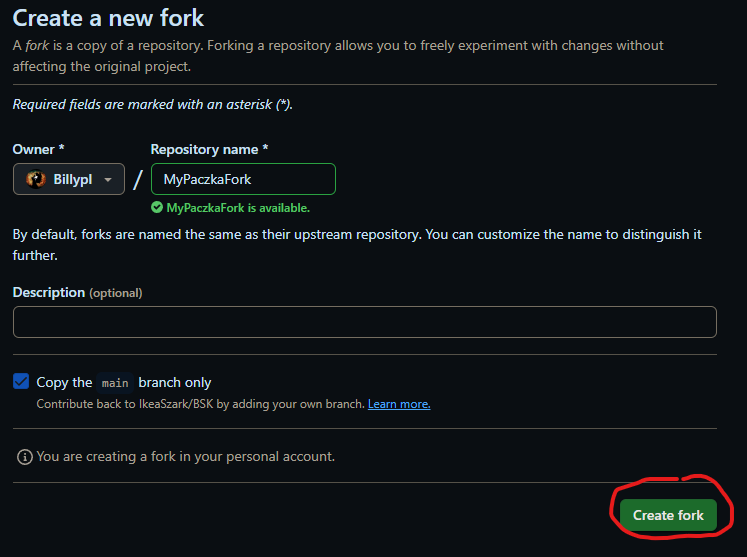
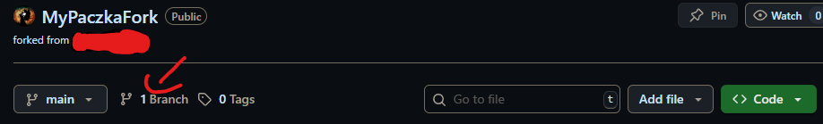
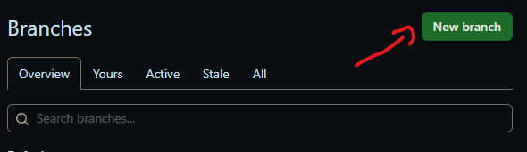
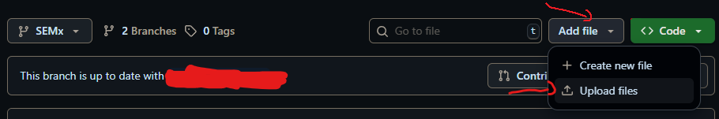
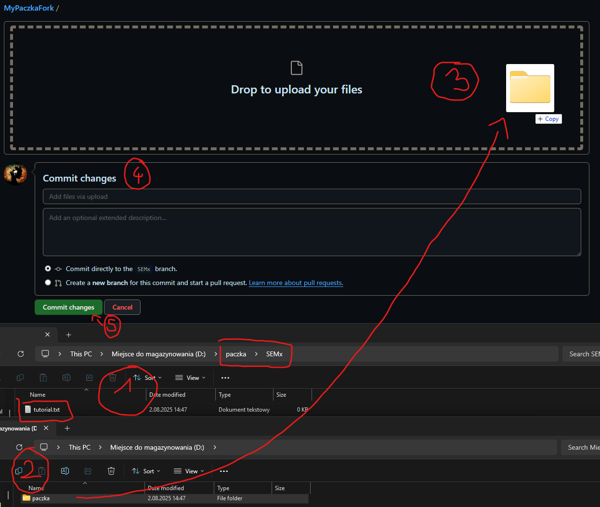
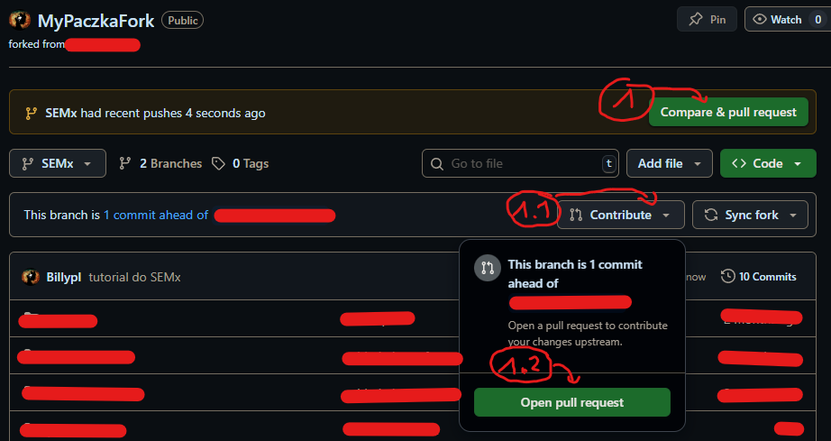
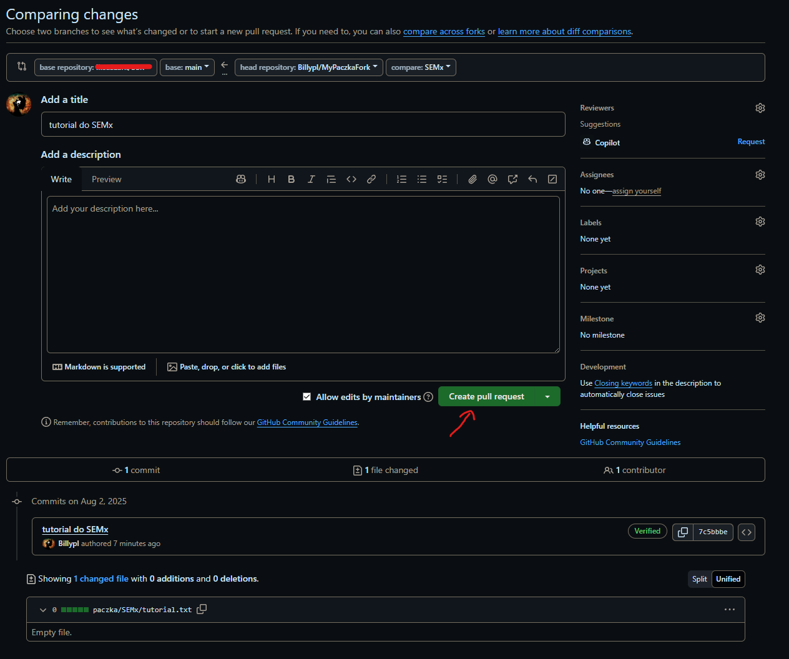
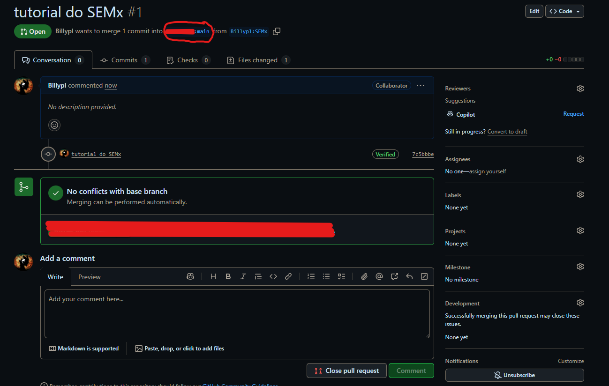
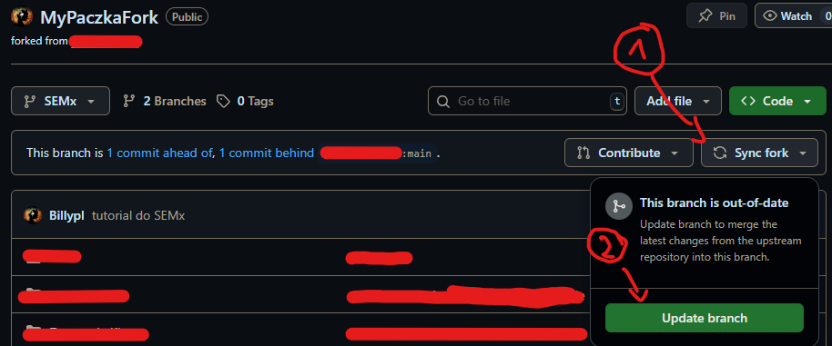

# Jak dodawać pliki do paczki?

## Spis treści
1. [Tutorial na YouTube](#tutorial-wideo-na-youtube) (kompleksowe omówienie)
2. [Tutorial w terminalu](#tutorial---w-terminalu) (dla bardziej zaawansowanych)
3. [Tutorial na stronie GitHuba](#tutorial---w-github-ui) (dla początkujących)
4. [Uwagi](#uwagi) (na co warto zwrócić uwagę)

## Tutorial wideo na YouTube:
[](https://youtu.be/tuTGdGo7trQ)

### [Paczka Tutorial all-in-one](https://youtu.be/tuTGdGo7trQ)

Spis treści:  
00:00:00 - [intro](https://youtu.be/tuTGdGo7trQ?t=0)  
00:01:24 - [geneza problemu](https://youtu.be/tuTGdGo7trQ?t=85)  
00:03:33 - [jak to działa?](https://youtu.be/tuTGdGo7trQ?t=214)  
00:07:32 - [omówienie repozytorium](https://youtu.be/tuTGdGo7trQ?t=452)  
00:12:23 - [wrzucanie plików](https://youtu.be/tuTGdGo7trQ?t=743)  
00:23:41 - [wrzucanie projektów](https://youtu.be/tuTGdGo7trQ?t=1422)  
00:31:57 - [publikowanie zmian](https://youtu.be/tuTGdGo7trQ?t=2517)  
00:48:14 - [logowanie do GH przez konsolę](https://youtu.be/tuTGdGo7trQ?t=2895)  
00:52:03 - [bonus - aktualizacja (pull)](https://youtu.be/tuTGdGo7trQ?t=3123)  
00:56:17 - [wystawianie pull requesta](https://youtu.be/tuTGdGo7trQ?t=3376)  
01:01:48 - [poprawianie pull requesta](https://youtu.be/tuTGdGo7trQ?t=3709)  
01:09:36 - [protipy dla windowsiarzy](https://youtu.be/tuTGdGo7trQ?t=4176)  
01:11:01 - [outro](https://youtu.be/tuTGdGo7trQ?t=4261)  


## Tutorial - w terminalu:
Nazwy z dużych liter (np. YOUR_BRANCH_NAME) muszą być uzupełnione faktycznymi nazwami.
```bash
### 1. zainstaluj GitHub i Git (pakiety gh oraz git) 
# (git odpowiada za repozytoria, gh za połączenie z GitHubem)
sudo apt install git
sudo apt install gh
gh auth login

### 2. zforkuj repozytorium i stwórz brancha
# (fork to twoja kopia repozytorium, branch to wersja repozytorium w której będziesz pracował)
gh repo fork Billypl/PaczkownicyInfaPG --clone
cd PaczkownicyInfaPG/paczka
git checkout -b YOUR_BRANCH_NAME

### 3. dodaj swoje pliki
# (w tym kroku czy to poprzez konsolę, czy zwykły eksprolator plików dodaj do repozytorium pliki które chcesz dodać do paczki)
# WAŻNE!! - przeczytaj docs/wytyczne.md w celu dostosowania nazw plików
cp ~/jakis_plik.txt paczka/SEMx/PRZEDMIOT/

### 4. dodaj pliki do swojego repozytorium lokalnie
git add .
git commit -m "WIADOMOŚĆ_OPISUJĄCA_ZMIANY"

### 5. prześlij pliki do swojego repozytorium na internecie: 
# - pierwszy raz
git push -u origin YOUR_BRANCH_NAME
# - każdy następny raz
git push

### 6. dodaj pliki do oficjalnej paczki po skończonej pracy
gh pr create --base master --head YOUR_USERNAME:YOUR_BRANCH_NAME --repo Billypl/PaczkownicyInfaPG
```


## Tutorial - w GitHub UI:  
Szybki tutorial wideo dla początkujących: https://www.youtube.com/watch?v=CML6vfKjQss  
### 1. Wejdź na stronę paczki (https://github.com/Billypl/PaczkownicyInfaPG)  
### 2. Kliknij przycisk "Fork" na głównej stronie  
Fork to sposób na zrobienie dokładnej kopii repoztytorium, która będzie należeć do ciebie. Dzięki temu nie popsujesz zmian innym i możesz dowolnie dodawać / usuwać / cofać / zmieniać.  

  

### 3. Stwórz forka  
Nadaj mu nazwę (może być taka sama jak orginalnego repozytorium) i kliknij "Create fork"  

  

### 4. Utwórz nowego brancha na twoje zmiany  
Branch to dosłownie "gałąź", czyli odnoga projektu. Dzięki stworzeniu takiej odnogi, nie będzie potem problemów przy próbie połączenia twojej wersji z wersją główną.  

4.1. Kliknij przycisk "Branch":  

  

4.2. Kliknij przycisk "New branch"  

  

4.3. Nadaj swojemu branchowi nazwę i kliknij "Create new branch"
Upewnij się, że twój branch ma nazę, która mówi, co dodajesz (np. `nazwa_przedmiotu_egzamin` gdy dodajesz zdjęcie egzaminu)  

  

4.4. Masz utworzonego własnego brancha!  
### 5. Dodaj pliki  
5.1. Kliknij przycisk "Add file" a później "Upload files" jeśli chcesz dodać pliki ze swojego komputera  

  

5.2. Upewnij się, że ten krok wykonasz według instrukcji. Żeby dodać plik w konkretny folder na GitHubie, musisz mieć taką samą strukturę u siebie. Jeżeli chcesz, możesz pobrać repozytorium w postaci .zip (zielony przycisk "Code" w poprzednim kroku), wypakować je, włożyć swoje pliki do folderu tam i wtedy cały folder "paczka" wrzucić w to miejsce. GitHub automatycznie odfiltruje, które pliki się zmieniły, a które nie, więc nie będzie przesyłał wszystkiego.  

**Ważne!!** - przeczytaj [wytyczne](../wytyczne/wytyczne.md) żeby dobrze nazywać pliki i wrzucać je w dobre miejsca.  

Po kolei:
1. Odwzoruj strukturę (lub po prostu pobierz zipa) u siebie na komputerze.
2. Chwyć za nadrzędny folder "paczka"
3. Przesuń go do pola "Drop to upload your files" na stronie GitHuba
4. Nadaj nazwę swoim zmianom. Upewnij się, że twój branch ma nazę, która mówi, co dodajesz (np. `dodanie egzaminu z nazwa_przedmiotu`)
5. Zatwierdź zmiany zielonym przyciskiem "Commit changes" 

  

### 6. Połącz swoje zmiany z główym zmianami (pull request)  
Gdy już dodałeś wszystkie rzeczy, które chciałeś, możesz scalić swoje zmiany z główną wersją paczki. W tym celu:  
- Opcja jeden:  
1 . Gdy przed chwilą coś zacommitowałeś, pojawi się taki poręczny żółtawy komunikat. Gdy klikniesz przycisk "Compare & pull request" zostaniesz przeniesiony do następnego kroku.
- Opcja dwa:  
1.1. Kliknij przycisk "Contribute"  
1.2. Kliknij zielony przycisk "Open pull request"  

  

### 6.1. Zatwierdź tworzenie pull requesta  
Ewentualnie dodaj jakiś komentarz od siebie. Na dole możesz sprawdzić wszystkie commity oraz pliki, w które zaingerowałeś.   
Gdy upewnisz się, że wszystko jest okej, kliknij zielony przycisk "Create pull request"  

  

### 7. To koniec!  
Gratulacje! Dodałeś swoje pierwsze zmiany. Teraz oczekują ona na zatwierdzenie przez administratora paczki. Może on poprosić cię o poprawienie niektórych rzeczy w razie potrzeby. Ty też w międzyczasie możesz dodawać / zmieniać pliki w razie potrzeby, jeśli o czymś zapomniałeś.

  


## Uwagi

### Przeczytaj [wytyczne](../wytyczne/wytyczne.md) i zachowaj porządek
Przed dodawaniem materiałów do paczki przeczytaj plik [wytyczne.md](../wytyczne/wytyczne.md) i stosuj się do nich. Pamiętaj - paczka jest dla was, więc fajnie by było móc szybko znaleźć to czego szukamy. Lepiej spędzić więcej czasu przy dodawaniu, niż potem za każdym razem przy szukaniu. Spójrz do [wytycznych](../wytyczne/wytyczne.md) i ponazywaj odpowiednio pliki i poumieszczaj je w odpowiednich miejscach.

### Puste foldery
Puste foldery na GitHubie nie są domyślnie uploadowane. Aby dodać pusty folder, należy umieścić plik nazwany **dokładnie** ".gitkeep". Będzie on dawał znać githubowi, że specjalnie dodajemy pusty folder, ale plik ten nie pojawi się w paczce.  

### Nowe zmiany  
Czasami do oryginalnej paczki ktoś może dodać zmiany, o których chcielibyśmy wiedzieć i mieć je u siebie. Aby je dodać również do swojego forka:  
1. Kliknij przycisk "Sync fork"  
2. Kliknij zielony przycisk "Update branch"  

  

### Usuwanie zbędnych plików  
Upewnij się, że dodajesz tylko niezbędne pliki (tzn. pliki źródłowe, takie jak .cpp, .c) a nie wynikowe (np. .exe, .dll) lub konfiguracyjne (np. .vscode, .projsx). Zapewni to mały rozmiar paczki i zostawi tylko niezbędne elementy.

Jeśli nie chcesz usuwać niczego ze swojego dysku, to polecam stworzyć plik `.gitignore` i w nim wpisać wszystkie rozszerzenia / nazwy plików / nazwy folderów, których nie chcesz umieszczać w paczce.  
Do pomocy w tym stworzyłem gitignore generator ([gitignore_generator.sh](../../utility/gitignore-generator.sh)) (działa tylko na Linuxie lub WSLu). Dokładny opis jak go używać jest dostępny na [repozytorium tego projektu](https://github.com/Billypl/GitignoreGenerator) lub przy użyciu flagi -h.

### Filmiki
Jeśli chodzi o filmy, to ogromna prośba, żeby wrzucać je na YouTube'a i załączać tylko linki. Przez naturę GitHuba ciężko wrzucać tam duże pliki. 

Może jako kolejny feature zostanie zrobione automatyczne pobieranie filmików z linku do YouTube na Google Drive. #feature 